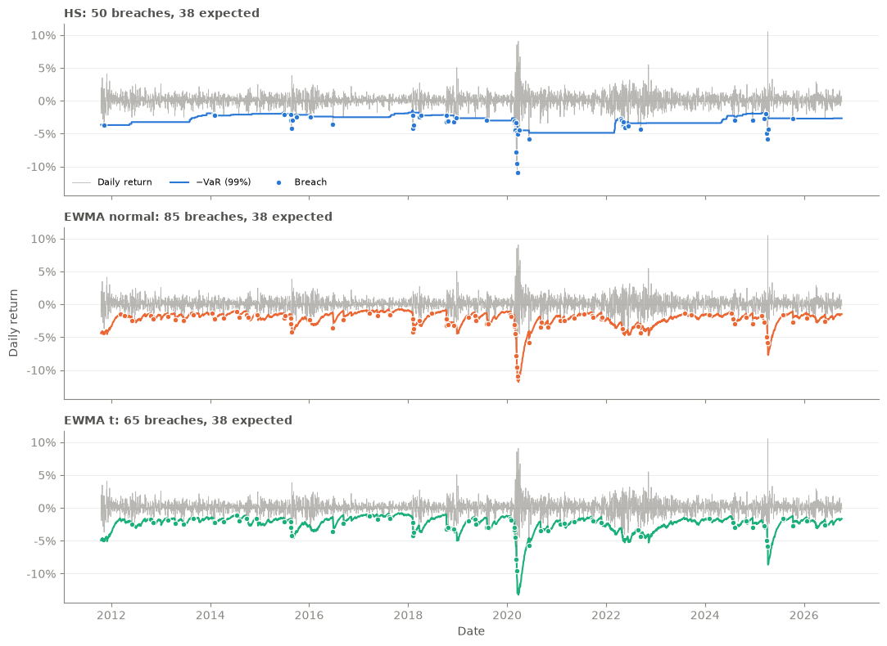
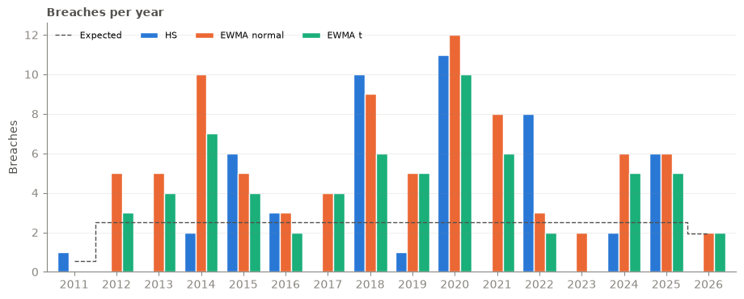

# podrisk

Portfolio risk analytics in Python: download prices, turn them into returns, and estimate Value at Risk (VaR) and Expected Shortfall (ES).

## Setup

Requires Python 3.13 and [uv](https://docs.astral.sh/uv/).

```bash
uv sync
```

## Layout

| File | What it does |
| --- | --- |
| `src/data.py` | Downloads prices from Yahoo Finance, cleans them, converts them to returns, and saves/loads them in an in-memory SQLite database |
| `src/model.py` | Risk models: historical simulation VaR/ES, EWMA volatility, and parametric (normal or Student-t) VaR/ES |
| `src/backtesting.py` | VaR backtests: exceedances, Kupiec, Christoffersen, and conditional coverage |
| `src/book.py` | Example portfolio of dollar positions, grouped by desk |
| `notebooks/backtesting.ipynb` | Walkthrough of backtesting the models on real data |

## Models

| Function | Description |
| --- | --- |
| `hs_var`, `hs_es` | Historical simulation VaR and ES over a rolling window (500 days by default) |
| `ewma_vol` | EWMA volatility, λ = 0.94 by default |
| `param_var`, `param_es` | Parametric VaR and ES from a volatility, using a normal or Student-t distribution |

Every rolling estimate is shifted by one day, so the figure for a given date uses only data from earlier dates. Losses are returned as positive numbers.

## Backtesting

| Function | Description |
| --- | --- |
| `exceedance` | Boolean series of breaches: days where the loss exceeded that day's VaR |
| `summary` | Number of days, breaches, expected breaches, and hit rate |
| `kupiec` | Unconditional coverage: is the hit rate equal to `alpha`? (χ², 1 df) |
| `christoffersen` | Independence: do breaches cluster from one day to the next? (χ², 1 df) |
| `conditional_coverage` | Kupiec + Christoffersen combined (χ², 2 df) |

Each test returns `(lr, p_value)`, where `lr` is the likelihood ratio statistic. A small p-value means the test rejects the VaR model.

## Example

```python
from data import clean_prices, download_prices, to_returns
from model import ewma_vol, hs_var, param_es, param_var

prices = clean_prices(download_prices(["SPY"]))
returns = to_returns(prices)["SPY"]

var_hs = hs_var(returns, alpha=0.01)

sigma = ewma_vol(returns)
var_t = param_var(sigma, alpha=0.01, dist="t", nu=5)
es_t = param_es(sigma, alpha=0.01, dist="t", nu=5)

from backtesting import conditional_coverage, exceedance, kupiec, summary

hits = exceedance(returns, var_t)
summary(hits, alpha=0.01)
lr, p = kupiec(hits, alpha=0.01)
lr, p = conditional_coverage(hits, alpha=0.01)
```

Run it from `src/` or add `src` to your `PYTHONPATH`.

## Results

99% one-day VaR on SPY daily returns, backtested from 2011-10-17 to 2026-10-07 (3,765 days). All three models are cut to the dates where every model has a forecast. See `notebooks/backtesting.ipynb` for the full walkthrough; rerun it to refresh the numbers.

| Model | Breaches | Expected | Hit rate | Kupiec p | Christoffersen p | Cond. coverage p |
| --- | ---: | ---: | ---: | ---: | ---: | ---: |
| HS (500 days) | 50 | 37.6 | 1.33% | 0.054 (pass) | <0.0001 (reject) | <0.0001 (reject) |
| EWMA normal (λ = 0.94) | 85 | 37.6 | 2.26% | <0.0001 (reject) | 0.015 (reject) | <0.0001 (reject) |
| EWMA t (λ = 0.94, ν = 5) | 65 | 37.6 | 1.73% | <0.0001 (reject) | 0.006 (reject) | <0.0001 (reject) |





- **No model passes conditional coverage.** HS has about the right number of breaches but they cluster; EWMA has too many and they cluster too.
- **HS passes Kupiec only just, and fails Christoffersen hard.** Its VaR barely moves, so breaches pile into 2018, 2020 and 2022. After a breach, the chance of another the next day is 14%, against about 1.2% after a normal day.
- **EWMA fails on the count.** With λ = 0.94 it reacts to shocks within days but forgets them within weeks, so its VaR drops too low in calm markets. A third of its breaches (28 of 85) fall in calm years like 2012-2014 and 2021.
- **The Student-t helps but doesn't fix it.** Fatter tails cut breaches from 85 to 65; the problem is the volatility forecast, not the tail shape.
- **Next steps:** a slower decay (λ = 0.97-0.99), a lower ν, or GARCH, whose variance reverts to a long-run level instead of collapsing in calm periods.

## Tests

```bash
uv run pytest
```

To skip the tests that need the network:

```bash
uv run pytest -m "not network"
```
