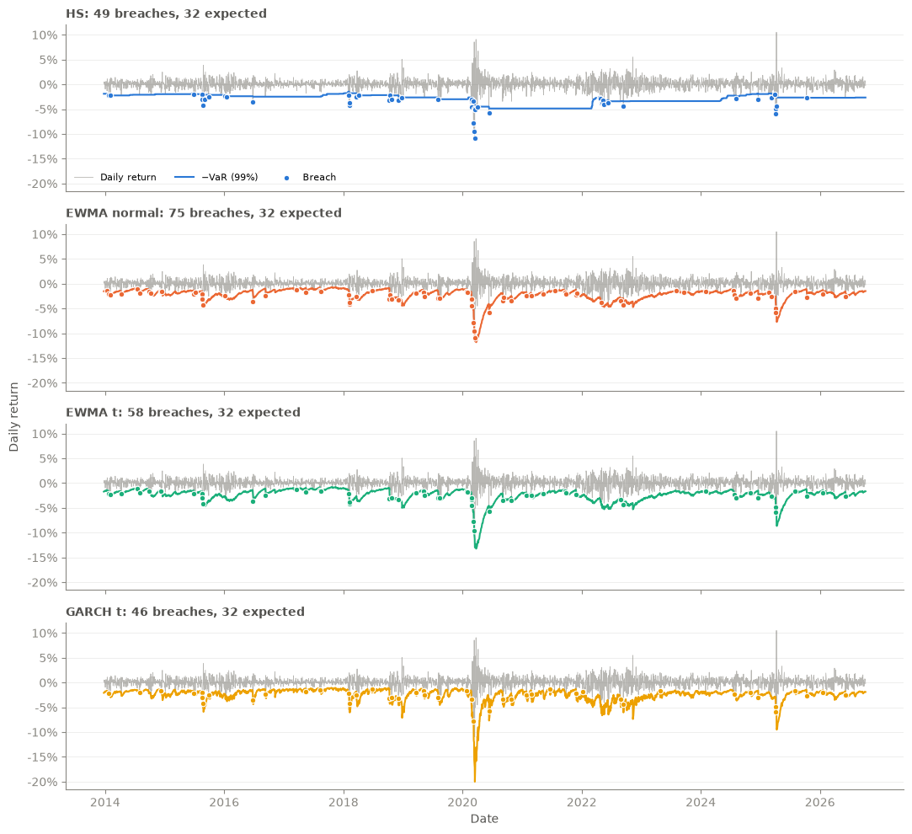
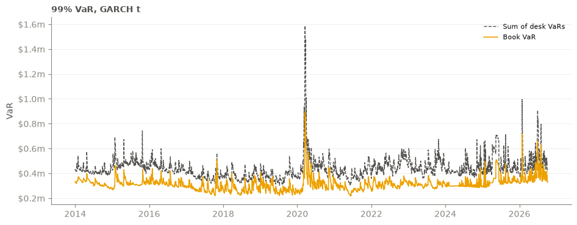

# podrisk

Value at Risk (VaR) and Expected Shortfall (ES) models in Python, with statistical backtests, applied to a single equity index and to a hedged multi-desk portfolio.

The project asks a practical question: **can a VaR model's forecasts be trusted, and does the answer depend on the portfolio?** Each model forecasts tomorrow's 99% VaR using only past data. Each forecast is then compared with what actually happened, using standard statistical coverage tests.

## Key findings

- **On SPY, every model is rejected.** EWMA forgets crashes within weeks and breaches too often in calm markets. Historical simulation reacts too slowly, so its breaches cluster in crises. GARCH comes closest, but SPY's losses are left-skewed (big down days are larger than big up days), which a symmetric Student-t tail cannot capture.
- **On a hedged long/short book, the results reverse.** Hedging cancels most of the market's crash asymmetry, so the book's tail is close to normal. EWMA with a Student-t passes every test on every desk, while GARCH t becomes too conservative (20 breaches against 32 expected).
- **The same model can be too risky for one portfolio and too cautious for another.** A fixed tail parameter (ν = 5) is too thin for SPY and too fat for the book.
- **Diversification between desks reduces VaR by 28% on average.** The two desks' P&L has a −0.10 correlation, so the book's VaR is well below the sum of the desk VaRs.

## Results

All results are one-day 99% VaR, so a correct model breaches on about 1% of days. Each test reports a p-value, and a p-value below 0.05 rejects the model.

### SPY

Daily SPY returns, 2013-12-24 to 2026-10-07 (3,215 days, 32.2 breaches expected).

| Model | Breaches | Kupiec p | Christoffersen p | Cond. coverage p |
| --- | ---: | ---: | ---: | ---: |
| Historical simulation | 49 | 0.006 | <0.001 | <0.001 |
| EWMA, normal | 75 | <0.001 | 0.009 | <0.001 |
| EWMA, Student-t | 58 | <0.001 | 0.004 | <0.001 |
| GARCH(1,1), Student-t | **46** | 0.021 | 0.004 | 0.001 |



### Hedged book

Hypothetical daily P&L of the example book in `src/book.py`, 2013-12-30 to 2026-10-07 (3,208 days, 32.1 breaches expected). The book has two desks:

- **equity_ls:** long $20m across AAPL, MSFT, JPM and UNH, short $20m SPY
- **rates_fx:** long TLT against short IEF ($10m each side), and long GBP against short EUR ($5m each side)

Results for the whole book:

| Model | Breaches | Kupiec p | Christoffersen p | Cond. coverage p |
| --- | ---: | ---: | ---: | ---: |
| Historical simulation | 42 | 0.093 | 0.291 | 0.140 |
| EWMA, normal | 36 | 0.495 | 0.366 | 0.527 |
| EWMA, Student-t | 25 | 0.191 | 0.531 | 0.350 |
| GARCH(1,1), Student-t | 20 | 0.021 | 0.616 | 0.062 |

EWMA with a Student-t passes every test on both desks and on the whole book. The notebook has the per-desk results.



| Mean 99% VaR (GARCH t) | |
| --- | ---: |
| equity_ls | $292k |
| rates_fx | $148k |
| Sum of desks | $440k |
| **Book** | **$313k** |

## Methodology

**Models.** Every model produces a one-day-ahead forecast using only data up to the previous day, and tests check this.

| Model | Volatility | Tail |
| --- | --- | --- |
| Historical simulation | None: uses the empirical 1% quantile of the last 500 days | Empirical |
| EWMA | Exponentially weighted, λ = 0.94 (RiskMetrics) | Normal or Student-t (ν = 5) |
| GARCH(1,1) | Refitted every 21 days on the trailing 1,000 days using [`arch`](https://github.com/bashtage/arch) | Student-t (ν = 5) |

The Student-t is rescaled to unit variance, so the volatility forecast keeps its meaning and only the shape of the tail changes.

**Backtests.**

| Test | Question | Distribution |
| --- | --- | --- |
| Kupiec (1995) | Is the breach rate equal to 1%? Too few breaches also fails. | χ², 1 df |
| Christoffersen (1998) | Are breaches independent, or does one breach make another more likely the next day? | χ², 1 df |
| Conditional coverage | Both at once | χ², 2 df |

**Portfolio P&L.** The book's daily P&L is the sum of position × return. Positions are held at fixed dollar amounts, so this is hypothetical P&L. Only days when every market traded are kept: FX trades on US holidays, and the FX return on the next shared day covers the gap.

## Limitations and next steps

- **ν is fixed at 5.** The results show it should be estimated for each series. Next step: use the ν fitted by GARCH, and try a skewed-t for SPY.
- **ES is estimated but not backtested.** An Acerbi–Székely test would cover it.
- **The book is modelled as a single P&L series.** A position-level model would allow component VaR, showing which positions drive the risk.
- **Data is downloaded live.** Results shift slightly each time the notebooks are rerun.

## Project structure

| Path | Contents |
| --- | --- |
| `src/data.py` | Price download (Yahoo Finance), cleaning, and conversion to returns |
| `src/model.py` | VaR/ES models: historical simulation, EWMA, GARCH, parametric normal and Student-t |
| `src/backtesting.py` | Breaches and the Kupiec, Christoffersen and conditional coverage tests |
| `src/book.py` | Example portfolio of dollar positions by desk |
| `notebooks/backtesting.ipynb` | SPY backtest of all four models |
| `notebooks/book_backtest.ipynb` | Desk and book backtests, and diversification |
| `test/` | Unit tests, including checks that no model uses future data |

## Usage

Requires Python 3.13 and [uv](https://docs.astral.sh/uv/).

```bash
uv sync
```

```python
from data import clean_prices, download_prices, to_returns
from model import garch_vol, param_var
from backtesting import conditional_coverage, exceedance, kupiec

returns = to_returns(clean_prices(download_prices(["SPY"])))["SPY"]

sigma = garch_vol(returns)
var = param_var(sigma, alpha=0.01, dist="t", nu=5)

hits = exceedance(returns, var)
lr, p = kupiec(hits, alpha=0.01)
lr, p = conditional_coverage(hits, alpha=0.01)
```

Run from `src/`, or add `src` to your `PYTHONPATH`.

## Tests

```bash
uv run pytest                    # all tests
uv run pytest -m "not network"   # skip tests that download data
```
